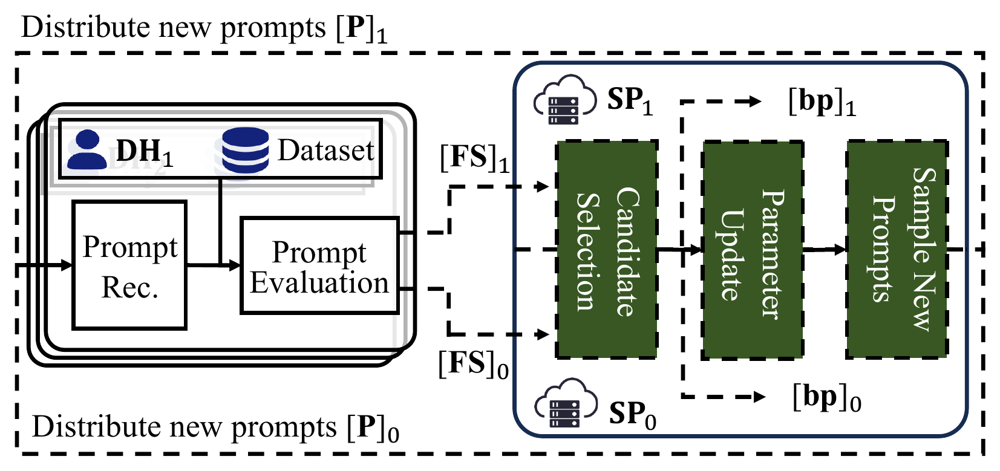
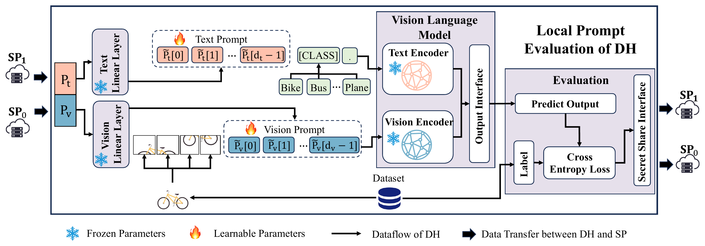

<h1 align="center">SGFPT</h1>

<h2 align="center">
  Secure Prompt Tuning Service:<br>
  A Private and Gradient-free Realization
</h2>

<p align="center">
  <a href="https://github.com/SkyTu">Xinyu Tu</a><sup>1</sup>
  &nbsp;·&nbsp;
  <a href="https://www.rmit.edu.au/profiles/l/xiaoning-liu">Xiaoning Liu</a><sup>2</sup>
</p>

<p align="center">
  <sup>1</sup>Fudan University &nbsp;·&nbsp; <sup>2</sup>RMIT University
</p>

<p align="center">
  <strong>IEEE Transactions on Services Computing (TSC), 2026</strong>
</p>

<p align="center">
  <a href="https://doi.org/10.1109/TSC.2026.3735318"></a>
  <a href="https://skytu.github.io/SGFPT/"></a>
  <a href="#citation"></a>
</p>

---

## Introduction

Prompt tuning adapts pre-trained models to downstream tasks without updating their weights. In cross-silo settings, enterprises often have sufficient computing resources to evaluate these models locally. The challenge is to collaboratively optimize prompts across distributed datasets while keeping each participant's data private.

Our paper introduces **SGFPT** (**S**ecure **G**radient-**F**ree **P**rompt **T**uning), a prompt generation service built on a semi-honest, two-server secure multi-party computation (MPC) model. SGFPT combines gradient-free optimization with local model evaluation: data holders evaluate candidate prompts $\mathbf{P}$ on their own datasets, while two non-colluding servers provide a secure prompt tuning service by securely aggregating the resulting fitness scores $\mathbf{FS}$, generating new candidates, and retaining the best prompt $\mathbf{bp}$ without accessing the data holders' local datasets.

Explore the protocol in our [interactive demonstration](https://skytu.github.io/SGFPT/).

<p align="center">
  <a href="assets/figure/Overview.pdf">
    
  </a>
</p>

## Service workflow

The system has two types of entities:

- **Data holders (DHs)** keep their models and datasets locally and evaluate candidate prompts without backpropagation.
- **Service provider (SP)** consists of two non-colluding servers, SP₀ and SP₁, that jointly perform secure prompt generation and optimizer updates.

In the paper's protocol, each data holder's dataset remains on premises, and its fitness scores are protected through secret sharing under the semi-honest, non-colluding-server threat model. Aggregating fitness scores across data holders helps mitigate the generalization problems associated with non-IID data, a common challenge in federated learning.

The service optimizes low-dimensional prompts with diagonal CMA-ES. Data holders use frozen CLIP or RoBERTa models for evaluation. Each generation follows this workflow:

1. **Sample** generates candidate prompts from the current CMA-ES state (mean, step size, and diagonal covariance).
2. **Client Evaluation** projects each candidate into model prompt embeddings and computes its loss on local data.
3. **SelectTop** aggregates candidate losses and selects the best candidates and their corresponding sampling values.
4. **Update** updates the CMA-ES state for the next generation.

Each generation uses fresh preprocessing matched to its sampling seed and state masks.

**Implementation scope:** Sample, SelectTop, and Update have numerical tests with zero and nonzero masks, including a continuous two-generation chain. The Python/CUDA network driver currently runs a zero-mask simulation and sends plaintext fitness to both parties. It does not yet implement the paper's private multi-data-holder deployment. The interactive demo illustrates the protocol; it does not execute the CUDA implementation.

## Repository layout

| Path | Contents |
|---|---|
| `src/Server-SGFPT/` | CUDA Sample, SelectTop, Update, and CMA-ES state |
| `src/Client-Evaluation/` | CLIP/RoBERTa evaluation, plaintext CMA-ES, datasets, and TCP protocol |
| `src/experiments/sgfpt/client.cu` | Two-party optimization driver |
| `src/fss/`, `src/utils/` | GPU/FSS implementation and shared utilities |
| `src/tests/spt/`, `src/tests/python/` | Numerical, protocol, and runtime tests |
| `src/Makefile` | CUDA build targets; run `make -C src` from the repository root |
| `ext/` | Vendored dependencies |
| `scripts/` | Test runners and small-model inference checks |
| `assets/` | Paper figures and README badges |
| `index.html` | Interactive demonstration |

## Installation

The code has been tested on a Linux server equipped with an NVIDIA GPU, using CUDA 11.8, GCC 11, Python 3.8.20, PyTorch 2.1.0, and torchvision 0.16.0. Building the project requires CMake `>=3.17,<4` and Eigen `>=3.3`. Install Eigen using your system package manager, or set `CMAKE_PREFIX_PATH` to the prefix of a custom Eigen installation.

```bash
git clone git@github.com:SkyTu/SGFPT.git
cd SGFPT

python3.8 -m venv .venv
source .venv/bin/activate
python -m pip install "cmake>=3.17,<4"
python -m pip install torch==2.1.0 torchvision==0.16.0 \
  --index-url https://download.pytorch.org/whl/cu118
python -m pip install -r src/Client-Evaluation/requirements.txt

export CUDA_HOME=/usr/local/cuda-11.8
export CUDA_ARCH=89  # Set this to your GPU's compute capability.
export CMAKE="$PWD/.venv/bin/cmake"
./setup.sh
make -C src -j2 CUDA_HOME="$CUDA_HOME" CUDA_ARCH="$CUDA_ARCH" \
  EIGEN_INCLUDE=/usr/include/eigen3 all
```

`setup.sh` builds the included Sytorch/LLAMA dependencies. `make -C src` uses `src/Makefile` and writes the service executable to `src/experiments/sgfpt/` and test executables to `src/tests/spt/`. Adjust `EIGEN_INCLUDE` if your Eigen headers are elsewhere. A local Eigen installation under `.deps/usr/` at the repository root is also supported by the default build settings. Model weights and datasets are not included.

## Run the tests

Activate the Python environment and run these commands from the repository root:

```bash
python -m unittest discover -s src/tests/python -v
./src/tests/spt/test_standard_normal 0
python scripts/validate_cuda.py
python scripts/validate_masks.py
python scripts/smoke_service.py
```

- `validate_cuda.py` runs the original Sample, SelectTop, and Update tests in two local processes.
- `validate_masks.py` runs 21 numerical cases: two Sample generations, SelectTop with one or three data holders, Update, and one- or two-generation operator chains. It uses zero masks and nonzero-mask seeds `12345` and `67890`, compares decoded outputs with CPU references, and returns a nonzero exit code on failure. The test dimensions are `lambda=8`, `mu=4`, `d=8`, with 24 fractional bits.
- `smoke_service.py` runs two CUDA parties and a mock data holder for two generations, then stops all three processes. No models or datasets are required.

The test runners write generated results under `logs/`. Run GPU tests sequentially because the two-party library uses fixed local peer ports. These bounded tests do not reproduce the paper's full training or WAN experiments.

## Plaintext model evaluation

The following figure illustrates local prompt evaluation for a vision-language model, following the [B2TPT](https://github.com/MFAaaaaaa/B2TPT) technique.

[](assets/figure/Client.pdf)

VLM tasks: `cifar100`, `dtd`, `eurosat`, `flower102` (also accepted as `flowers102`), and `pets`.

```bash
python src/Client-Evaluation/vlm_server.py --plaintext --task cifar100 \
  --data-dir /path/to/data --prompt-save /path/to/best_prompt.npy
python src/Client-Evaluation/vlm_server.py --inference-only --task cifar100 \
  --data-dir /path/to/data --prompt-save /path/to/best_prompt.npy
```

LLM tasks: `sst2`, `mrpc`, `rte`, `yelp_polarity`, and `ag_news`.

```bash
export HF_DATASETS_CACHE=/path/to/dataset-cache
export TRANSFORMERS_CACHE=/path/to/model-cache
python src/Client-Evaluation/llm_server.py --plaintext --task mrpc --gpu 0
python src/Client-Evaluation/llm_server.py --inference-only --task mrpc --gpu 0 \
  --prompt-save /path/to/best_prompt_llm_plaintext.npy
```

Configuration files are `src/Client-Evaluation/configs/vlm.yaml` and `src/Client-Evaluation/configs/llm.yaml`; they resolve relative to the evaluator scripts. CLIP weights default to `~/dataset/clip`. For later inference, retain the model, projection seed, prompt dimensions, and configuration used during optimization.

To check real model forward passes using existing local weights and data:

```bash
python scripts/validate_inference.py \
  --data-root /path/to/cifar-data \
  --roberta-path /path/to/roberta-large \
  --mrpc-arrow /path/to/glue-train.arrow
```

This checks two CLIP candidates on a CIFAR100 batch of two, one plaintext CMA-ES update, and a RoBERTa-Large forward pass on two MRPC examples.

## Network simulation

Start a Python evaluator without `--plaintext`, then start both CUDA parties. The evaluator and clients must agree on population size, prompt dimension, batch count, and generations per batch. Use each evaluator's `--help` for its options.

```text
src/experiments/sgfpt/sgfpt_client <party> <peer_ip> [host] [port] [lambda] [mu] [d]
    [scale] [n_batches] [batch_size] [party_num] [gpu_id] [r_per_batch]
```

`party` is 0 or 1; `peer_ip` identifies the other CUDA party, and `host:port` identifies the Python evaluator. `party_num` is the simulated number of data holders. The total generation count is `n_batches * r_per_batch`; the current driver requires `scale=24`. For a small ready-to-run example, use `python scripts/smoke_service.py`.

## Citation

If you use this code in your research, please cite:

```bibtex
@article{11698666,
  author={Tu, Xinyu and Liu, Xiaoning},
  title={Secure Prompt Tuning Service: A Private and Gradient-free Realization},
  journal={IEEE Transactions on Services Computing},
  year={2026},
  pages={1--12},
  doi={10.1109/TSC.2026.3735318},
  url={https://doi.org/10.1109/TSC.2026.3735318},
  publisher={IEEE Computer Society}
}
```

## Acknowledgments

The CLIP prompt evaluator derives from [B2TPT](https://github.com/MFAaaaaaa/B2TPT). The GPU/FSS implementation builds on [Orca](https://eprint.iacr.org/2023/206) and [SIGMA](https://eprint.iacr.org/2023/1269). Vendored components retain their copyright notices and included licenses, including [CUTLASS](ext/cutlass/LICENSE.txt) and [cryptoTools](ext/sytorch/ext/cryptoTools/LICENSE).
